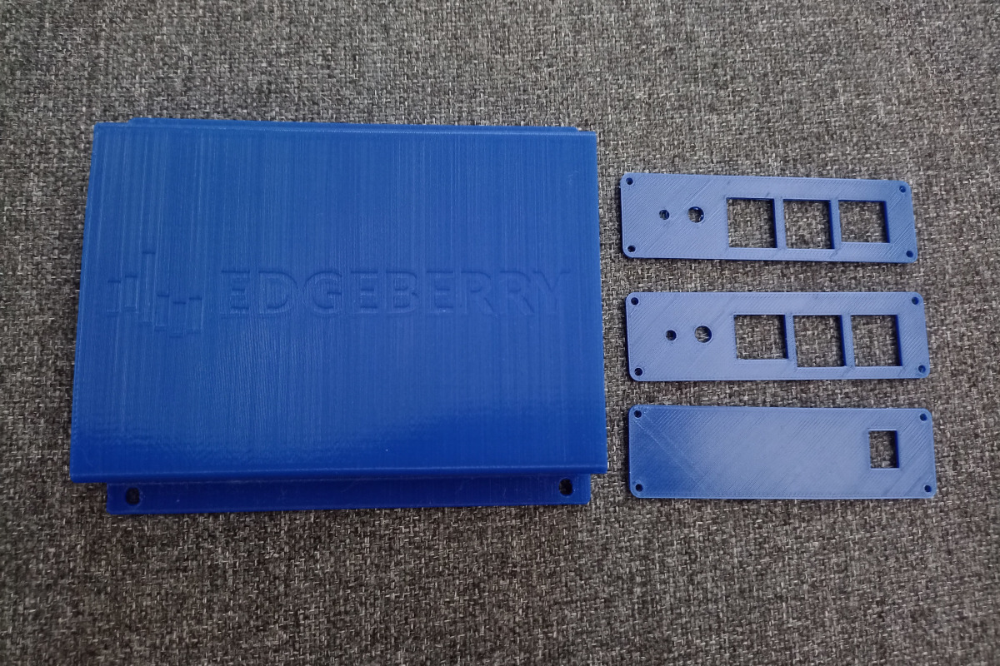

The IoT Edge is one of the most compelling frontiers in information technology; the domain where the digital realm converges with the physical world through interconnected devices equipped with sensors and actuators. This technology empowers data-driven decision making, streamlining of processes, enhanced monitoring capabilities, ... So, for example, you can unload the laundry just-in-time (_smart washing machine_) before your partner noticeably gets upset (_wearable heart rate monitor_), significantly improving your quality of life.


Whether you are a weathered engineer making a quick proof-of-concept for an IoT solution, or a student of the information technology arts dipping your toes in the shallow part of the connected devices pool. With the Edgeberry project you turn your favorite single-board computer into an IoT Edge device in the blink of a cursor! Leveraging the robust foundation of this trusted, open-source, and widely supported computing system, Edgeberry seamlessly integrates essential IoT functionalities allowing you to fully focus on bringing your IoT idea to life.

##### Edgeberry's device software provides:
- An intuitive web interface for configuring the cloud connection and managing your application, available on your local network
- Reliable integration of device provisioning and connection processes for several popular IoT platforms
- A comprihensive SDK to interface your edge device application to the cloud
- Out-of-the-box compatibility with the Edgeberry Dashboard

##### Integrated IoT platforms:
- AWS IoT Core _(currently recommended)_
- Microsoft Azure IoT Hub

# Installation
On your device, install the Edgeberry application by downloading and executing the installation script
```
wget -O install.sh https://github.com/SpuQ/EdgeBerry/releases/download/v2.3.3/install.sh
sudo ./install.sh
```
If everything was successful, you can now access your Edgeberry's web interface in your local network
```
http://<device_ip_address>:3000
```

# Application development
When creating your IoT Edge application with Edgeberry, use the [Edgeberry SDK](https://github.com/SpuQ/EdgeBerry-SDK) for interacting with the cloud through the Edgeberry platform.

```
NodeJS:
npm install --save @spuq/edgeberry-sdk
```
For information on using the SDK, check out the [SDK documentation](https://github.com/SpuQ/EdgeBerry-SDK?tab=readme-ov-file#readme).
<br/>

> [!IMPORTANT]  
> Following IO pins are controlled by the Edgeberry application to use with the [Edgeberry Hardware](https://github.com/SpuQ/EdgeBerry?tab=readme-ov-file#edgeberry-hardware), and should not be used in your application to avoid unpredictable behavior: **GPIO5** (buzzer), **GPIO6** (button), **GPIO19** (status LED, red), **GPIO26** (status LED, green).

# The Edgeberry Project

The Edgeberry project aims to provide the essentials for using your Raspberry Pi or compatible platform in a wide range of IoT applications, increasing the accessability of the IoT Edge and enabling rapid development of IoT applications.

### Edgeberry Hardware


Edgeberry features a [Raspberry Pi-compatible hat](https://edgeberry.io), enhancing its capabilities with a built-in 3A step-down power supply enabling you to power your device reliably using a 12V adaptor. Additionally, it includes indicators for providing status feedback, and an expansion slot for integrating [custom hardware](https://edgeberry.io).

<br clear="left"/>

### Edgeberry Hardware Cartridge


Each IoT application has its own hardware requirements. We've covered the basics with the Edgeberry Hardware, but the rest is up to you! Design your appication-specific hardware to fit with the Edgeberry Hardware.

<br clear="left"/>

### Edgeberry Enclosure



We love the sight of bare circuit boards, right? But to improve durability and reliability of your Edgeberry setup in real-world environments, use the [Edgeberry enclosure](https://www.thingiverse.com/thing:6595172) for enhanced protection and some additional style.

<br clear="left"/>

### Edgeberry Dashboard
For managing your fleet of Edgeberry devices, create an account on [Edgeberry.io](https://edgeberry.io/dashboard) and connect your IoT platform.

# License & Collaboration
Copyright 2024 Sanne 'SpuQ' Santens. The Edgeberry device software is licensed under the [MIT License](LICENSE.txt).

> [!NOTE] 
> Edgeberry is released under a permissive license, granting you absolute freedom to utilize this project as you see fit. I've made this choice because I believe that progress is best achieved through collaboration; by trusting each other's values and intentions, and by freely exchanging knowledge and technology. However, it's crucial to recognize that with great power comes great responsibility. As we gain access to increasingly potent tools and technologies, we possess the capability to create things with real impact. Therefore I ask you, fellow creator, to be mindful about your intentions and inventions.

### Collaboration

If you'd like to contribute to this project, please follow these guidelines:
1. Fork the repository and create your branch from `main`.
2. Make your changes and ensure they adhere to the project's coding style and conventions.
3. Test your changes thoroughly.
4. Ensure your commits are descriptive and well-documented.
5. Open a pull request, describing the changes you've made and the problem or feature they address.