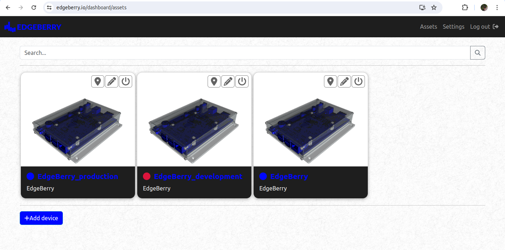

The IoT Edge is one of the most compelling frontiers in information technology; the domain where the digital realm converges with the physical world through interconnected devices equipped with sensors and actuators. This technology empowers data-driven decision making, streamlining of processes, enhanced monitoring capabilities, ... So, for example, you can unload the laundry just-in-time (_smart washing machine_) before your partner noticeably gets upset (_wearable heart rate monitor_), significantly improving your quality of life.


Whether you are a weathered engineer making a quick proof-of-concept for an IoT solution, or a student of the information technology arts dipping your toes in the shallow part of the connected devices pool. With the Edgeberry project you turn your favorite single-board computer into an IoT Edge device in the blink of a cursor! Leveraging the robust foundation of this trusted, open-source, and widely supported computing system, Edgeberry seamlessly integrates essential IoT functionalities allowing you to fully focus on bringing your IoT idea to life.

# Installation
On your device, install the Edgeberry application by downloading and executing the installation script
```
wget -O install.sh https://github.com/SpuQ/Edgeberry/releases/download/v2.4.0/install.sh
chmod +x ./install.sh
sudo ./install.sh
```
If everything was successful, you can now access your Edgeberry's web interface in your local network
```
http://<device_ip_address>:3000
```

# Application development
When creating your IoT Edge application with Edgeberry, use the **Edgeberry SDK**.

> [!WARNING]
> The SDK is currently undergoing substantial changes in architecture. Because of this, no information is currently available or published. But we'll get to it as soon as possible!

> [!IMPORTANT]  
> Following IO pins are controlled by the Edgeberry application to use with the [Edgeberry Hardware](https://github.com/SpuQ/EdgeBerry?tab=readme-ov-file#edgeberry-hardware), and should not be used in your application to avoid unpredictable behavior: **GPIO5** (buzzer), **GPIO6** (button), **GPIO19** (status LED, red), **GPIO26** (status LED, green).

# The Edgeberry Project

The Edgeberry project aims to provide the essentials for using your Raspberry Pi or compatible platform in a wide range of IoT applications, increasing the accessability of the IoT Edge and enabling rapid development of IoT applications.

### Edgeberry Hardware


Edgeberry features a [Raspberry Pi-compatible hat](https://github.com/SpuQ/Edgeberry-hardware), enhancing its capabilities with a built-in 3A step-down power supply enabling you to power your device reliably using a regular 12V adaptor. Additionally, it includes indicators for providing visible and audible status feedback, and an expansion slot for integrating application-specific hardware using a [Edgeberry Hardware Cartridge](https://github.com/SpuQ/EdgeBerry?tab=readme-ov-file#edgeberry-hardware-cartridge). Check out the [Assembly Guide](assets/Assembly_Guide.pdf) to tickle your imagination.


<br clear="left"/>

### Edgeberry Hardware Cartridge


Each IoT application has its own hardware requirements. We've covered some of the basics by using Raspberry Pi with the Edgeberry Hardware, but the rest is up to you! Choose a suitable [Edgeberry Hardware Cartridge](https://github.com/SpuQ/EdgeBerry?tab=readme-ov-file#edgeberry-hardware-cartridge) that fits your application, or design your own using the [Edgeberry Hardware Cartridge design guidelines](assets/Hardware_Cartridge_Design_Guide.pdf).

<br clear="left"/>

### Edgeberry Enclosure


We love the sight of bare circuit boards, right? But to improve durability and reliability of your Edgeberry setup in real-world environments, use the [Edgeberry enclosure](https://www.thingiverse.com/thing:6595172) for enhanced protection and some additional style.

<br clear="left"/>

### Edgeberry Dashboard



Use the [Edgeberry Dashboard](https://edgeberry.io/dashboard) for managing all your Edgeberry devices in one place. Wherever they are, wherever you are, you're always connected.


# License & Collaboration
**Copyright© 2024 Sanne 'SpuQ' Santens**. The Edgeberry device software is licensed under the **[GNU GPLv3](LICENSE.txt)**.

>[!IMPORTANT]
>When your own application uses the Edgeberry API to interact with the Edgeberry software, **the GNU GPLv3 does <ins>not</ins> affect your project**, and you are free to publish (or not publish) your project however you like. I know reading "GNU GPL" in a repository can be intimidating, but no worries there!

### Collaboration

If you'd like to contribute to this project, please follow these guidelines:
1. Fork the repository and create your branch from `main`.
2. Make your changes and ensure they adhere to the project's coding style and conventions.
3. Test your changes thoroughly.
4. Ensure your commits are descriptive and well-documented.
5. Open a pull request, describing the changes you've made and the problem or feature they address.